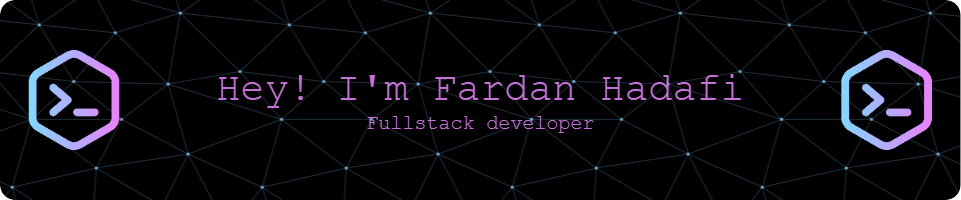

<h2 align="left">About me</h2>

  
  

###

<h2 align="left">📚 I'm currently learning Fullstack Web Developer</h2>

###

<h2 align="left">I code with</h2>

###

  
  
  
  
  
  
  
  
  
  
  
  
  
  
  
  
  
  
  
  
  
  
  
  
  

###

###

<picture>
  <source media="(prefers-color-scheme: dark)" srcset="https://raw.githubusercontent.com/FardanHadafi/FardanHadafi/output/pacman-contribution-graph-dark.svg">
  <source media="(prefers-color-scheme: light)" srcset="https://raw.githubusercontent.com/FardanHadafi/FardanHadafi/output/pacman-contribution-graph.svg">
  
</picture>

###
